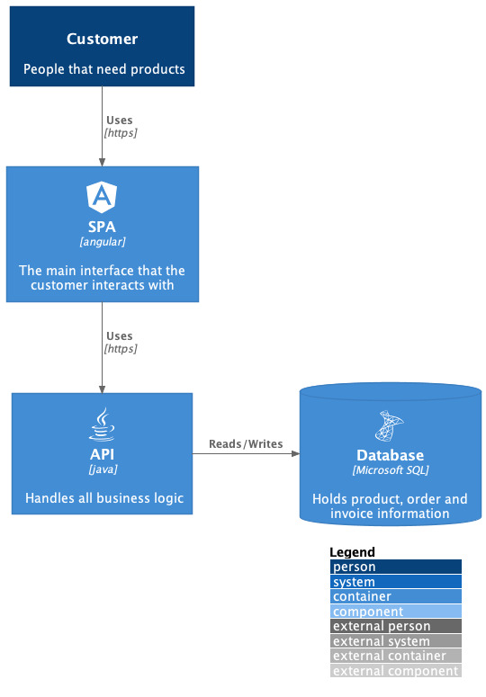

# C4-PlantUML Project Template

This is a template to easily generate [PlantUML][1] diagrams with the [C4 Model][2] notation using the [C4-PlantUML][3]

## Benefits on top of

- Github template ready to use
- Generate PNG files with a single command
- Independent of any internet connectivity after clone
- Auto update of [C4-PlantUML][3] files with a single command
- [C4-PlantUML][3] and [plantuml-icon-font-sprites][4] used as git submodules
- Only requires `plantuml` binary in the `PATH` environment


> C4-PlantUML combines the benefits of [PlantUML][1] and the [C4 model][2] for providing a simple way of describing and communicate software architectures – especially during up-front design sessions – with an intuitive language using open source and platform independent tools.

## Getting Started

Clone the github template, using git clone or download using https

### Create your PlantUML diagrams

Under the `diagrams` folder, create your diagrams adding the relative import to the [C4-PlantUML][3] includes:

```puml
@startuml
!include ../C4-PlantUML/C4_Component.puml

.
.
.
@enduml
```

### Fetch the latest updates for [C4-PlantUML][3] and [plantuml-icon-font-sprites][4]

This is only required the first time and when you want to update the submodules.

```sh
$ make update
```

### Execute on single command to generate all the diagrams

```sh
$ make
```

### All PNG diagrams generated under `diagrams/*.png`



[1]: http://en.plantuml.com/
[2]: https://c4model.com/
[3]: https://github.com/plantuml-stdlib/C4-PlantUML
[4]: https://github.com/tupadr3/plantuml-icon-font-sprites/
